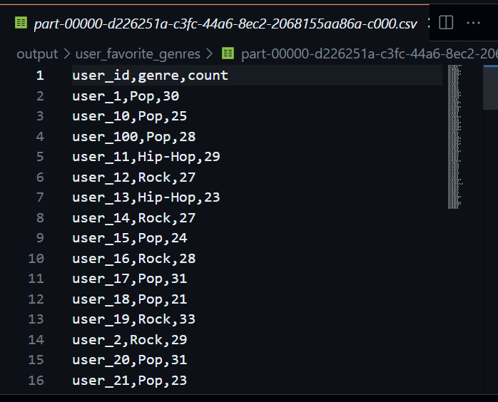
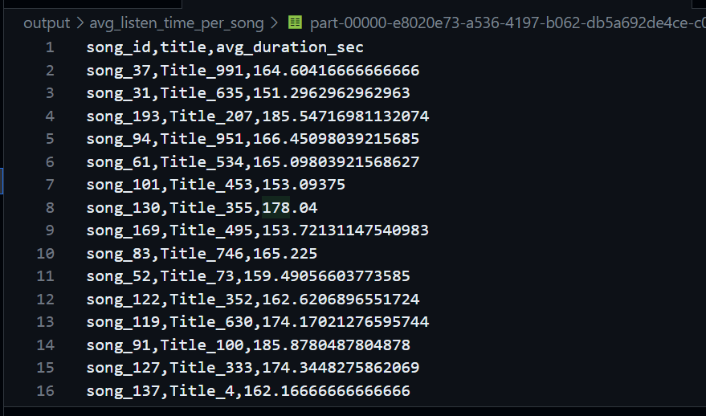
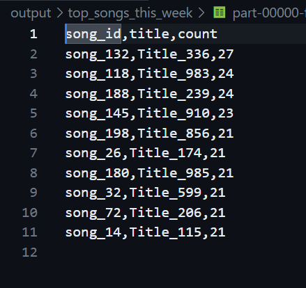
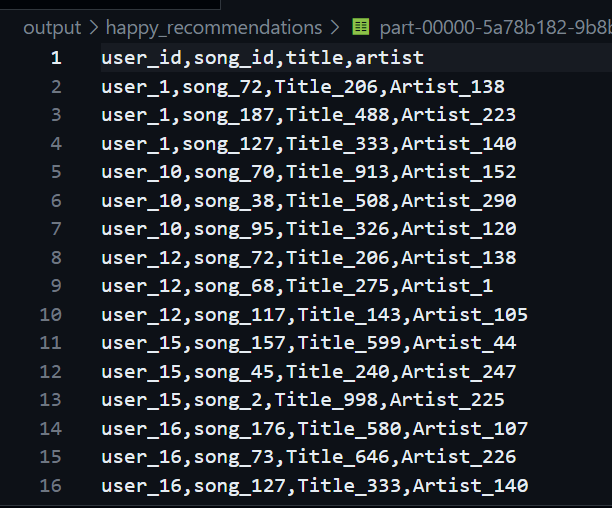
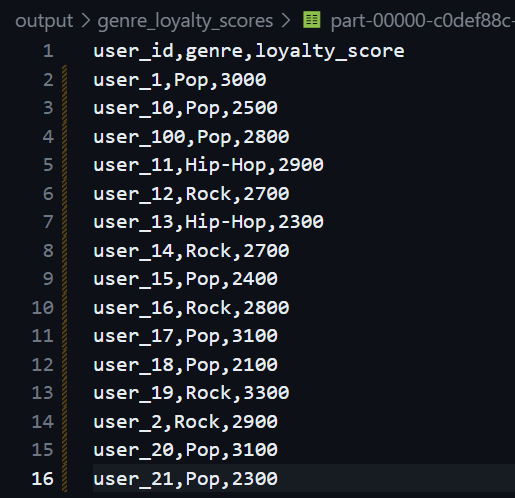
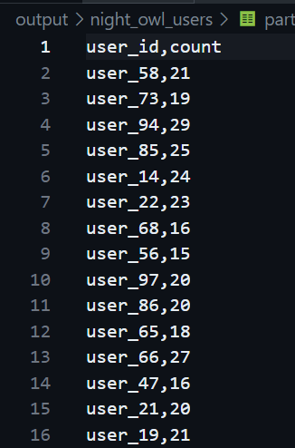

# 🎵 Music Streaming Analysis with PySpark

This project analyzes user listening behavior and music trends on a fictional music streaming platform using **Apache Spark Structured APIs**. It processes logs and metadata to provide insights into user preferences, genre loyalty, and song popularity.

---

## 📁 Dataset Details

### `listening_logs.csv`
Contains logs of user listening activity:

| Column     | Description                          |
|------------|--------------------------------------|
| user_id    | Unique identifier for each user      |
| song_id    | Unique identifier for each song      |
| timestamp  | Date and time when the song was played (`YYYY-MM-DD HH:MM:SS`) |
| duration_sec | Duration in seconds the song was played |

### `songs_metadata.csv`
Contains metadata for each song:

| Column   | Description                        |
|----------|------------------------------------|
| song_id  | Unique identifier for each song    |
| title    | Song title                         |
| artist   | Artist name                        |
| genre    | Genre of the song (Pop, Rock, etc.)|
| mood     | Mood category (Happy, Sad, etc.)   |

---

## ✅ Tasks Performed

### 1. 🎧 User's Favorite Genre
- Identified the most played genre for each user.

### 2. ⏱ Average Listen Time Per Song
- Calculated the average duration each song is listened to across users.

### 3. 🔝 Top 10 Songs This Week
- Extracted the most played songs from the current week (starting 2025-03-23).

### 4. 😊 Recommend "Happy" Songs to Sad Listeners
- Suggested 3 random “Happy” songs to users who mainly listen to “Sad” songs and haven’t heard them before.

### 5. 💯 Genre Loyalty Score
- Computed the proportion of plays from a user's top genre. Displayed users with loyalty scores above **0.8**.

### 6. 🌙 Night Owl Users
- Identified users who frequently listen to music between **12 AM – 5 AM**.

### 7. 🧾 Enriched Logs
- Combined both datasets into a unified and enriched dataset for further analysis.

---

## 📂 Output Directory Structure

```
output/
├── user_favorite_genres/
├── avg_listen_time_per_song/
├── top_songs_this_week/
├── happy_recommendations/
├── genre_loyalty_scores/
├── night_owl_users/
└── enriched_logs/
```

Each folder contains result files saved using `.write.csv(..., header=True)`.

---

## ▶️ Running the Script

### 🔧 Requirements
- Python 3.x
- PySpark
- Datasets: `listening_logs.csv` and `songs_metadata.csv` in the working directory

### 📜 Run the Script
```bash
spark-submit analysis.py
```

---

## 💠 Common Errors & Fixes

| Error | Fix |
|------|-----|
| `java.lang.IllegalArgumentException: requirement failed: No input paths specified in DataFrameReader` | Ensure CSV files exist in the script directory |
| `AnalysisException: cannot resolve column` | Check for typos in column names |
| Incorrect data types (e.g., string instead of timestamp/int) | Used `withColumn` to cast properly |

---

## 📸 Screenshots

* Find each user’s favorite genre.


* Calculate the average listen time per song.


* List the top 10 most played songs this week.


* Recommend “Happy” songs to users who mostly listen to “Sad” songs.


* Compute the genre loyalty score for each user.


* Identify users who listen to music between 12 AM and 5 AM.



---

## 🧠 Author

**[Ramala Prasanth Reddy]**  
Spark Structured Streaming | Music Analytics Assignment

